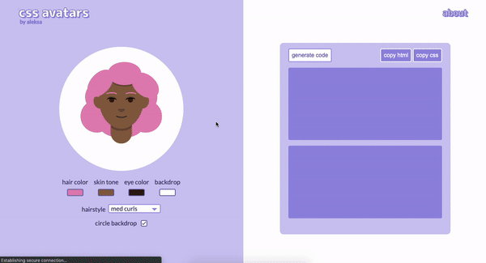

# ✨ CSS Avatars ✨ #

A JavaScript generator that creates the code for customized CSS avatars.

    

## Built With ##
Html, JavaScript, and CSS - nothing but the basics!

## About ##
This app was made just for fun as an exploration of CSS. After getting into creating CSS art, (which you can find [here](https://codepen.io/collection/XWmPNK)) I wanted to build something more fleshed out that focused on CSS.

## Future Updates ##
I do plan to add facial expressions, accessories, and more hair styles in the future. 